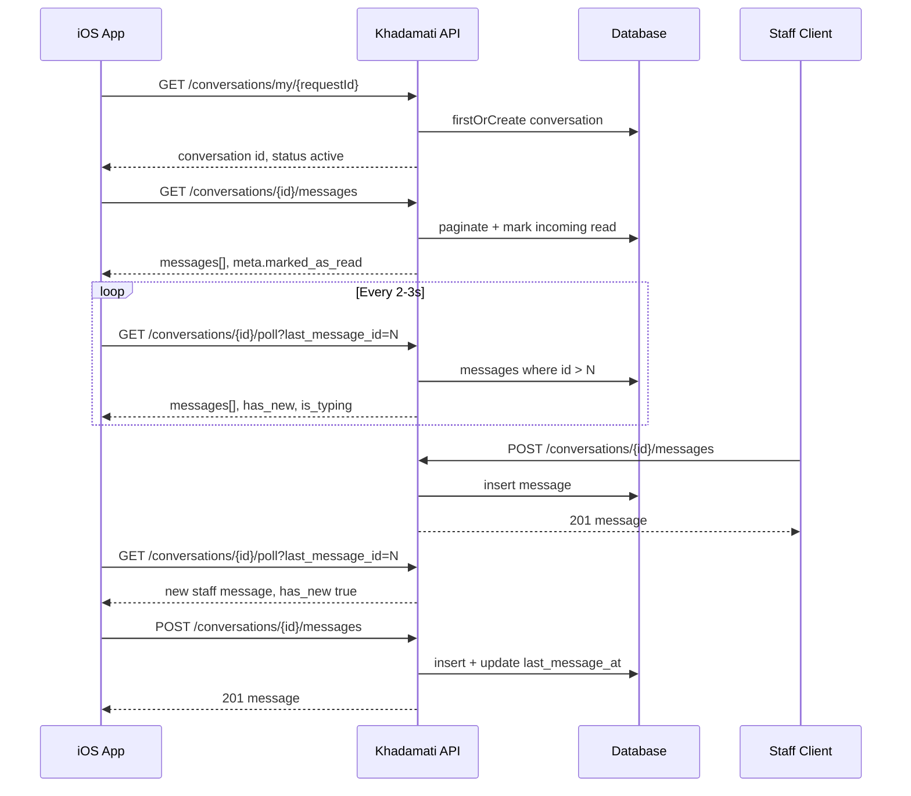

# Khadamati iOS — In-App Messaging

Citizen ↔ staff chat tied to a **service request**. One conversation per request (per citizen). Real-time updates use **HTTP polling** (no WebSockets). Push notifications for new messages are **not implemented yet** (see [Limitations](#limitations)).

**Base URL:** `{APP_URL}/api`  
**Auth:** `Authorization: Bearer {sanctum_token}` on every endpoint below.  
**Content-Type:** `application/json`

**Postman:** Folder **10. Conversations & Messages** in [`khadamati-ios.postman_collection.json`](khadamati-ios.postman_collection.json).

---

## Response format (messaging)

Most Khadamati APIs use the standard envelope (`success`, `message`, `errors`, `data`). **Messaging controllers return a slimmer shape:**

| Field | Present on messaging endpoints |
|-------|--------------------------------|
| `success` | Always |
| `message` | On some errors and on send success |
| `data` | On success |
| `errors` | Rarely (validation usually returns `message` only) |
| `meta` | On `GET .../messages` (read receipt side effect) |

Parse `success` first; read payloads from `data`.

---

## Concepts

| Concept | Description |
|---------|-------------|
| **Conversation** | Thread linked to one `service_request_id`, one `citizen_id`, one `staff_id`. |
| **Message** | Text row in a conversation; max **1000** characters. |
| **Assignment gate** | Chat is only available after the request has `assigned_staff_id` set. |
| **Status** | `active` — send/receive allowed. `closed` — read-only; new sends return **400**. |
| **Read state** | Per message: `is_read`, `read_at`. Opening a thread or polling marks incoming messages read for the current user. |
| **Typing** | Ephemeral flag in cache (~3s TTL); exposed via poll as `is_typing`. |

### Who can chat?

| Role | iOS app usage |
|------|----------------|
| **Citizen** | Full messaging flow (this document). |
| **Staff** | Uses `/conversations/staff/*` (staff web dashboard), not the citizen iOS app. |
| **Admin** | Can close conversations; not a chat participant by default. |

---

## Data model

### `conversations`

| Column | Type | Notes |
|--------|------|--------|
| `id` | bigint | Conversation ID used in URLs. |
| `service_request_id` | FK | One thread per request (for that citizen). |
| `citizen_id` | FK → users | Request owner. |
| `staff_id` | FK → users, nullable | Copied from `service_requests.assigned_staff_id`. |
| `status` | string | `active` \| `closed` |
| `last_message_at` | timestamp, nullable | Updated on each sent message. |
| `created_at`, `updated_at` | timestamps | |

### `messages`

| Column | Type | Notes |
|--------|------|--------|
| `id` | bigint | Monotonic; used for poll cursor `last_message_id`. |
| `conversation_id` | FK | |
| `sender_id` | FK → users | |
| `receiver_id` | FK → users | Other party. |
| `sender_type` | enum | `citizen` \| `staff` (set by server on send). |
| `message` | text | Body (max 1000 chars). |
| `is_read` | boolean | |
| `read_at` | timestamp, nullable | |
| `created_at`, `updated_at` | timestamps | |

### Relationships (API payloads)

Conversation JSON often includes eager-loaded:

- `service_request` — reference, status, etc.
- `staff` / `citizen` — `id`, `name`, `email` (User model fields)
- `last_message` — latest message preview
- `unread_count` — **computed** for the authenticated user (not a DB column)

Message JSON often includes:

- `sender` — user who sent the message

---

## Prerequisites (business rules)

```mermaid
flowchart TD
    A[Citizen opens request detail] --> B{assigned_staff_id set?}
    B -->|No| C[Show: Chat unavailable until staff assigned]
    B -->|Yes| D[GET /conversations/my/{serviceRequestId}]
    D --> E{Conversation exists?}
    E -->|No| F[Server creates conversation active + staff_id]
    E -->|Yes| G[Return existing conversation]
    F --> H[Open chat screen]
    G --> H
    H --> I[Load messages + start poll loop]
```

1. Citizen must be logged in (Sanctum token).
2. Citizen must **own** the service request (`user_id` matches).
3. Request must have **`assigned_staff_id`** not null. Otherwise `GET /conversations/my/{id}` returns **400**.
4. Conversation is created lazily on first `GET /conversations/my/{serviceRequest}` (not when the request is submitted).

**Check assignment from request detail:**

`GET /my-requests/{id}` includes `assigned_staff_id` and `assigned_staff` when loaded. If `assigned_staff_id` is `null`, disable or hide the chat entry point.

---

## iOS flow logic (recommended)

### A. Inbox / list (optional)

Use either:

- **Per-request only:** Chat button only on request detail (simplest).
- **Global inbox:** `GET /conversations/my` — all threads for the citizen, sorted by `last_message_at` desc.

Poll badge counts globally:

- `GET /conversations/unread/count` → total unread across all threads.
- `GET /conversations/unread/per-conversation` → map `{ "conversationId": count, ... }` for per-row badges.

### B. Open chat for one request

```
1. GET /api/conversations/my/{serviceRequestId}
   → Save conversation.id
   → If 400: show "No staff assigned yet"

2. GET /api/conversations/{conversationId}/messages?page=1
   → Render message list (paginated, 50 per page)
   → Server marks all messages where receiver = me as read
   → Store highest message.id as lastMessageId

3. Start poll timer (e.g. every 2–3 seconds while screen visible):
   GET /api/conversations/{conversationId}/poll?last_message_id={lastMessageId}
   → Append data.messages if has_new
   → Update lastMessageId from data.last_message_id
   → Show typing UI if data.is_typing

4. On send:
   POST /api/conversations/{conversationId}/messages
   { "message": "..." }
   → Append returned message to UI
   → Update lastMessageId
   → Optionally refresh poll immediately

5. While user types (optional):
   POST /api/conversations/{conversationId}/typing
   { "is_typing": true }   // debounced, e.g. every 1s while typing
   On stop / send:
   { "is_typing": false }

6. On leave chat screen:
   - Stop poll timer
   - POST typing is_typing: false
```

### C. Message bubble alignment

Use `sender_id` compared to current user id (from `GET /me`):

| Condition | UI |
|-----------|-----|
| `sender_id == currentUser.id` | Outgoing (right) |
| else | Incoming (left) |

Alternatively use `sender_type === "citizen"` only if the app is citizen-only (always compare `sender_id` is safer).

### D. Read receipts

- **Bulk mark read:** Loading `GET .../messages` marks all unread messages addressed to you in that conversation.
- **Poll:** Each new message in `poll` where you are `receiver_id` is marked read when returned.
- **Single message:** `PATCH /conversations/messages/{messageId}/read` if you need explicit per-message ack.

Display: `is_read` on outgoing messages when staff has read (staff opened thread or polled).

### E. Closed conversation

If `conversation.status === "closed"`:

- Show history (read-only).
- Hide composer; `POST .../messages` returns **400**.
- Poll may still return history cursor but no new sends from staff in practice.

Citizens **cannot** call `PATCH .../close` (staff/admin only).

### F. Delete message (optional)

`DELETE /conversations/messages/{messageId}` — only **sender** within **5 minutes** of `created_at` (unless admin). Citizen can delete own typos quickly.

---

## Polling strategy (iOS)

| Parameter | Recommendation |
|-----------|----------------|
| Interval | 2–3 s while chat screen is active |
| Pause | Stop when app backgrounded or user leaves screen |
| Cursor | `last_message_id` = highest `id` in local list (0 on empty thread) |
| Backoff | Optional: increase to 5–10 s after 5 minutes idle |
| Battery | Do not poll globally at high frequency; use unread endpoints on list screens at lower frequency |

**Poll response handling:**

```text
if data.has_new:
    append data.messages
last_message_id = data.last_message_id
show_typing_indicator = data.is_typing
```

Typing indicator: when citizen types, POST `is_typing: true` every ~1s; POST `false` on send or blur. Staff’s poll will see `is_typing` for the other party.

---

## API reference (citizen / iOS)

All paths are under `{APP_URL}/api`. `{conversation}` and `{serviceRequest}` are numeric IDs.

### Conversations

#### List my conversations

`GET /conversations/my`

**Auth:** Required (citizen).

**Response `200`:**

```json
{
  "success": true,
  "data": [
    {
      "id": 1,
      "service_request_id": 12,
      "citizen_id": 3,
      "staff_id": 2,
      "status": "active",
      "last_message_at": "2026-05-19T14:30:00.000000Z",
      "unread_count": 1,
      "service_request": { "id": 12, "reference_number": "KHR-20260519-SEED001", "status": "under_review" },
      "staff": { "id": 2, "name": "Nadia Staff", "email": "staff@khadamati.com" },
      "last_message": {
        "id": 15,
        "message": "Please upload a clearer scan.",
        "sender_type": "staff",
        "created_at": "2026-05-19T14:30:00.000000Z"
      }
    }
  ]
}
```

---

#### Get or create conversation for a request

`GET /conversations/my/{serviceRequest}`

**Auth:** Required. Citizen must own the request.

**Path:** `serviceRequest` = service request ID (route model binding).

**Success `200`:** Single conversation object (same shape as list item), with `unread_count`.

**Errors:**

| Status | `message` (typical) |
|--------|---------------------|
| 403 | Not your service request |
| 400 | No staff has been assigned to this request yet |

**Server behavior:**

- `firstOrCreate` on `(service_request_id, citizen_id)`.
- Sets `staff_id` from `assigned_staff_id` on create; backfills `staff_id` if missing.

---

#### Unread count (total)

`GET /conversations/unread/count`

**Response `200`:**

```json
{
  "success": true,
  "data": {
    "unread_count": 3
  }
}
```

Counts all messages where `receiver_id` = current user and `is_read` = false (all conversations).

---

#### Unread count per conversation

`GET /conversations/unread/per-conversation`

**Response `200`:**

```json
{
  "success": true,
  "data": {
    "1": 0,
    "2": 3
  }
}
```

Keys are conversation IDs (strings in JSON). Use for inbox badges.

---

### Messages

#### Load messages (initial / pagination)

`GET /conversations/{conversation}/messages`

**Query:** Standard Laravel pagination, e.g. `?page=1` (default page size **50**, ascending by `created_at`).

**Side effect:** All messages in this conversation where `receiver_id` = you and `is_read` = false are marked read.

**Response `200`:**

```json
{
  "success": true,
  "data": {
    "current_page": 1,
    "data": [
      {
        "id": 10,
        "conversation_id": 1,
        "sender_id": 3,
        "receiver_id": 2,
        "sender_type": "citizen",
        "message": "Hello, I submitted my request.",
        "is_read": true,
        "read_at": "2026-05-19T12:00:00.000000Z",
        "created_at": "2026-05-19T11:00:00.000000Z",
        "updated_at": "2026-05-19T12:00:00.000000Z",
        "sender": { "id": 3, "name": "Jane Citizen" }
      }
    ],
    "last_page": 1,
    "per_page": 50,
    "total": 3
  },
  "meta": {
    "marked_as_read": 2
  }
}
```

**iOS:** For long history, load page 1 for oldest or use last page for newest depending on UI (default order is **oldest first**). Many chat UIs request page `last_page` first or reverse the array for bottom-anchored bubbles.

---

#### Poll for new messages

`GET /conversations/{conversation}/poll`

**Query:**

| Param | Required | Description |
|-------|----------|-------------|
| `last_message_id` | No | Default `0`. Return messages with `id > last_message_id`. |

**Side effect:** New messages in the response where you are receiver are marked read.

**Response `200`:**

```json
{
  "success": true,
  "data": {
    "messages": [
      {
        "id": 11,
        "conversation_id": 1,
        "sender_id": 2,
        "receiver_id": 3,
        "sender_type": "staff",
        "message": "We received your documents.",
        "is_read": true,
        "read_at": "2026-05-19T14:31:00.000000Z",
        "created_at": "2026-05-19T14:30:00.000000Z",
        "sender": { "id": 2, "name": "Nadia Staff" }
      }
    ],
    "last_message_id": 11,
    "has_new": true,
    "is_typing": false,
    "timestamp": "2026-05-19T14:31:05.000000Z"
  }
}
```

When no new messages: `messages: []`, `has_new: false`, `last_message_id` unchanged.

---

#### Send message

`POST /conversations/{conversation}/messages`

**Body:**

```json
{
  "message": "Thanks, I will upload the file today."
}
```

| Field | Rules |
|-------|--------|
| `message` | Required, string, max 1000 |

**Success `201`:**

```json
{
  "success": true,
  "message": "Message sent successfully",
  "data": {
    "id": 12,
    "conversation_id": 1,
    "sender_id": 3,
    "receiver_id": 2,
    "sender_type": "citizen",
    "message": "Thanks, I will upload the file today.",
    "is_read": false,
    "read_at": null,
    "created_at": "2026-05-19T14:35:00.000000Z",
    "sender": { "id": 3, "name": "Jane Citizen" }
  }
}
```

**Errors:**

| Status | Cause |
|--------|--------|
| 403 | Not a participant |
| 400 | Conversation `closed` or no `staff_id` |
| 422 | Validation (`message` missing/too long) |
| 500 | Server/DB failure |

**Server:** Updates `conversations.last_message_at` to now.

---

#### Typing indicator

`POST /conversations/{conversation}/typing`

**Body:**

```json
{
  "is_typing": true
}
```

| Field | Rules |
|-------|--------|
| `is_typing` | Required boolean |

**Success `200`:**

```json
{
  "success": true,
  "data": {
    "is_typing": true
  }
}
```

**Server:** Cache key `typing_{conversationId}_{userId}` = true for **3 seconds**; false clears key.

---

#### Mark one message read

`PATCH /conversations/messages/{message}/read`

**Auth:** Must be `receiver_id` of that message.

**Success `200`:**

```json
{
  "success": true,
  "message": "Message marked as read"
}
```

---

#### Delete message

`DELETE /conversations/messages/{message}`

**Auth:** Sender only; within **5 minutes** of send (admin exempt).

**Success `200`:**

```json
{
  "success": true,
  "message": "Message deleted successfully"
}
```

---

## Endpoints not used by iOS (reference)

| Method | Path | Who |
|--------|------|-----|
| `GET` | `/conversations/staff` | Staff inbox |
| `GET` | `/conversations/staff/{conversation}` | Staff thread detail |
| `PATCH` | `/conversations/{conversation}/close` | Staff/admin closes thread |

---

## Sequence diagram (send + receive)



---

## Demo / seeded data

After `php artisan migrate:fresh --seed`:

| Item | Value |
|------|--------|
| Citizen | `citizen@khadamati.com` |
| Staff | `staff@khadamati.com` |
| Request | Reference like `KHR-*-SEED001` (under review, assigned staff) |
| Conversation | Linked to that request |
| Messages | 3 seeded messages (1 unread from citizen to staff) |

**Try in Postman:**

1. OTP login as `citizen@khadamati.com` (or use seeded token flow).
2. `GET /my-requests` → pick request with `assigned_staff_id`.
3. `GET /conversations/my/{service_request_id}`.
4. `GET /conversations/{conversation_id}/messages`.
5. `GET /conversations/{conversation_id}/poll?last_message_id=0`.

---

## Error handling cheat sheet (iOS)

| HTTP | User-facing suggestion |
|------|-------------------------|
| 401 | Re-login |
| 403 | Not allowed to view this thread |
| 400 | Staff not assigned yet, or chat closed |
| 404 | Invalid conversation/request id |
| 422 | Show validation message from body |
| 500 | Retry; generic error |

Always read `message` on failures when present.

---

## Limitations and roadmap

| Topic | Current behavior |
|-------|------------------|
| Real-time transport | HTTP polling only; no WebSocket/SSE |
| Push (APNs/FCM) | Not sent on new message (`TODO` in code) |
| Attachments | Text only; no images/files in chat |
| Rich content | No markdown, reactions, or edits (only delete within 5 min) |
| Group chat | Exactly two participants (citizen + one staff) |
| Multiple staff | `staff_id` follows `assigned_staff_id`; reassignment may update staff on existing conversation |
| Standard API envelope | Messaging omits `errors` / `message` on many success responses |

For product notifications on request updates (not chat), see notifications section in [`ios-api.md`](ios-api.md).

---

## Quick reference — citizen endpoints

| Method | Endpoint | Purpose |
|--------|----------|---------|
| `GET` | `/conversations/my` | Inbox list |
| `GET` | `/conversations/my/{serviceRequestId}` | Open/create thread for request |
| `GET` | `/conversations/unread/count` | Total unread badge |
| `GET` | `/conversations/unread/per-conversation` | Per-thread badges |
| `GET` | `/conversations/{conversationId}/messages` | Load history (paginated) |
| `GET` | `/conversations/{conversationId}/poll` | New messages + typing |
| `POST` | `/conversations/{conversationId}/messages` | Send text |
| `POST` | `/conversations/{conversationId}/typing` | Typing on/off |
| `PATCH` | `/conversations/messages/{messageId}/read` | Mark one read |
| `DELETE` | `/conversations/messages/{messageId}` | Delete own (≤5 min) |

---

## Related APIs

| API | Relation |
|-----|----------|
| `GET /my-requests/{id}` | Request detail; check `assigned_staff_id` before chat |
| `GET /me` | Current user id for bubble alignment |
| `POST /device-tokens`, `POST /fcm-token` | Device registration (future push for chat) |

Full citizen API index: [`ios-api.md`](ios-api.md).
