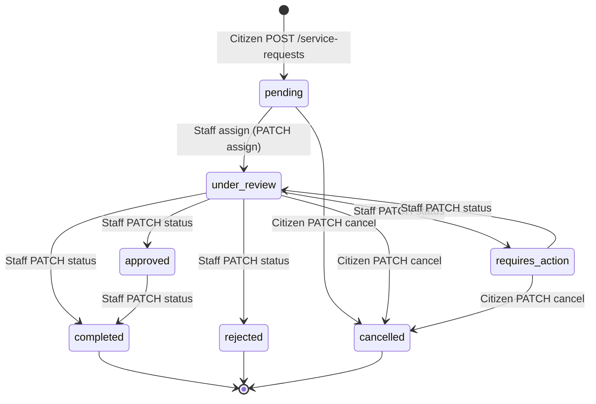
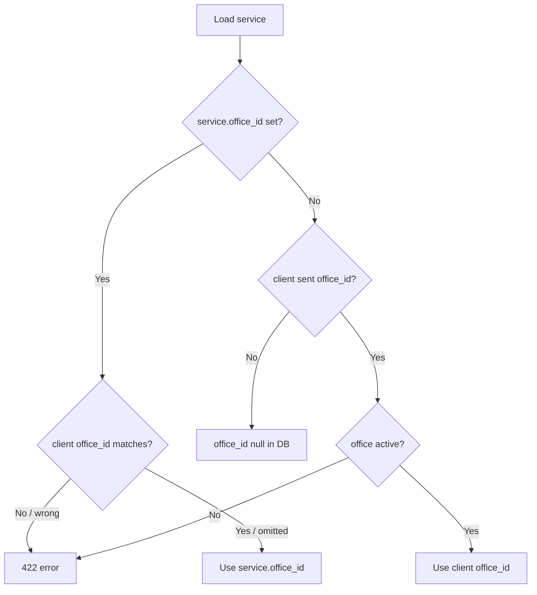

# Khadamati iOS — Citizen Service Request Flow

End-to-end guide for how a citizen discovers a service, submits a request, uploads documents, pays fees, books appointments, tracks progress, chats with staff, and leaves feedback.

**Base URL:** `{APP_URL}/api`  
**Auth:** `Authorization: Bearer {sanctum_token}` on protected routes  
**Postman:** Folder **Service Requests** (and related folders) in [`khadamati-ios.postman_collection.json`](khadamati-ios.postman_collection.json)  
**API index:** [`ios-api.md`](ios-api.md) (field-level reference)  
**Messaging:** [`ios-messaging.md`](ios-messaging.md) (after staff assignment)

---

## Table of contents

1. [High-level journey](#high-level-journey)
2. [Prerequisites](#prerequisites)
3. [Status model](#status-model)
4. [Lifecycle & who changes status](#lifecycle--who-changes-status)
5. [iOS screen flow (recommended)](#ios-screen-flow-recommended)
6. [Create a request](#create-a-request)
7. [List & detail](#list--detail)
8. [Documents](#documents)
9. [Tracking (public)](#tracking-public)
10. [Appointments](#appointments)
11. [Payments](#payments)
12. [Cancel](#cancel)
13. [Certificate](#certificate)
14. [Feedback](#feedback)
15. [Staff-driven side effects (citizen view)](#staff-driven-side-effects-citizen-view)
16. [Notifications](#notifications)
17. [Error handling](#error-handling)
18. [Demo data](#demo-data)

---

## High-level journey

```mermaid
flowchart TB
    subgraph discover [Discover]
        A[GET /service-categories] --> B[GET /services/{id}]
        B --> C[GET /offices?service_id=]
    end

    subgraph submit [Submit]
        C --> D[POST /service-requests]
        D --> E[Upload documents POST .../documents]
    end

    subgraph staff [Staff / system - not iOS citizen]
        E --> F[Staff assigns self]
        F --> G[Staff updates status]
        G --> H[Staff uploads official docs]
    end

    subgraph citizen [Citizen continues]
        G --> I{status?}
        I -->|requires_action| E
        I -->|under_review| J[Chat if assigned_staff_id]
        I -->|approved/completed| K[Payment / certificate / feedback]
        D --> L[GET /appointments/availability]
        L --> M[POST /appointments]
        D --> N[GET /track/{token} public]
    end
```

A request is always owned by the authenticated citizen (`user_id`). Staff and admin actions happen on the dashboard/API (`/staff/requests/*`) but drive what the citizen sees in `GET /my-requests/{id}`.

---

## Prerequisites

| Requirement | Why |
|-------------|-----|
| Valid Sanctum token | All `/my-requests/*`, documents, payments, appointments |
| `profile_completed` (typical prod flow) | OTP/social login may return `profile_completed: false` until `POST /profile/complete` |
| Active service | `POST /service-requests` returns **404** if service `is_active` is false |
| Correct office | Office-specific services ignore wrong `office_id`; global services need a valid active `office_id` or omit it |

Citizens **cannot** assign staff, change request status, or upload official/certificate documents.

---

## Status model

| Status | Meaning for citizen |
|--------|---------------------|
| `pending` | Submitted; waiting for staff assignment / initial review |
| `under_review` | Staff assigned (usually); being processed |
| `requires_action` | Citizen must do something (often re-upload documents) |
| `approved` | Approved; may proceed toward completion / pickup |
| `rejected` | Denied; see `rejection_reason` |
| `completed` | Finished; certificate, feedback, official docs available |
| `cancelled` | Cancelled by citizen (or admin) |

Constants live in `App\Support\ServiceRequestStatus`.

### Timeline (computed)

`GET /my-requests/{id}` includes a **3-step timeline** (not stored in DB):

| Step key | Label | Marked completed when |
|----------|-------|------------------------|
| `submitted` | Request Submitted | `submitted_at` or `created_at` exists |
| `reviewed` | Under Review | `reviewed_at` set **or** status is not `pending` |
| `completed` | Completed | `status === completed` |

Each step: `{ key, label, status: "completed"|"pending", occurred_at: ISO8601|null }`.

---

## Lifecycle & who changes status



### Citizen actions by status

| Action | pending | under_review | requires_action | approved | rejected | completed | cancelled |
|--------|---------|--------------|-----------------|----------|----------|-----------|-----------|
| Upload documents | ✓ | ✓ | ✓ | ✓ | ✗ | ✗ | ✗ |
| Delete own requirement docs | ✓* | ✓* | ✓* | ✓* | ✗ | ✗ | ✗ |
| Cancel request | ✓ | ✓ | ✓ | ✗ | ✗ | ✗ | ✗ |
| Book appointment | ✓† | ✓† | ✓† | ✓† | ✓† | ✓† | ✗ |
| Create payment | ✓‡ | ✓‡ | ✓‡ | ✓‡ | ✓‡ | ✓‡ | ✗ |
| Open chat | ✗ | ✓§ | ✓§ | ✓§ | ✗ | ✓§ | ✗ |
| Submit feedback | ✗ | ✗ | ✗ | ✗ | ✗ | ✓ | ✗ |
| View certificate | ✗ | ✗ | ✗ | ✗ | ✗ | ✓ | ✗ |

\* Not if document `status === approved`  
† Slot rules apply; one non-cancelled appointment per request when no `staff_id`  
‡ No duplicate `pending`/`paid` payment per request; amount &gt; 0  
§ Requires `assigned_staff_id` — see [ios-messaging.md](ios-messaging.md)

### Staff assignment (enables review + chat)

`POST /staff/requests/{id}/assign` (staff/admin):

- Sets `assigned_staff_id`
- If status was `pending` → becomes `under_review`
- Sets `reviewed_at` if not already set
- Staff must belong to the request’s `office_id` when office is set

Citizen sees `assigned_staff_id` and optional `assigned_staff` on the request resource.

---

## iOS screen flow (recommended)

### 1. Service catalog

1. `GET /service-categories` → category list  
2. `GET /services?category_id=` → services with `image_url`, `base_fee`, `issues_certificate`  
3. `GET /services/{id}` → `required_documents[]` for upload UI planning  

### 2. Office selection (if needed)

- Service tied to one office (`service.office_id` set): use that office; do not send a different `office_id`.  
- Global service: `GET /offices?service_id={id}` → user picks office → pass `office_id` on create.

### 3. Submit request

`POST /service-requests` → navigate to **Request detail** with returned `id`.

Show:

- `reference_number` (support reference)
- `tracking_api_url` / QR for public tracking
- `missing_documents` after refresh via `GET /my-requests/{id}`

### 4. Request detail hub

Drive UI from `status` + loaded relations:

| Section | Source field | When to show |
|---------|--------------|--------------|
| Status badge | `status` | Always |
| Timeline | `timeline` | Always |
| Missing docs CTA | `missing_documents` | Non-empty |
| Requirement uploads | `requirement_documents` | Until terminal status |
| Official outputs | `official_documents` | When staff uploaded |
| Staff message | `rejection_reason` | `rejected` |
| Payment card | `payment` | When present |
| Appointment card | `appointment` | When present |
| Chat entry | `assigned_staff_id != null` | Active chat rules in messaging doc |
| Certificate | — | `completed` + service issues certificate |
| Feedback | — | `completed`, no existing `feedback` |

### 5. Poll / refresh

- Pull-to-refresh on detail: `GET /my-requests/{id}`  
- Optional public poll: `GET /track/{tracking_token}` (no auth, limited fields)  
- Notifications: `GET /notifications` for `request_updated`, `document_upload`, `payment_updated`, `appointment_updated`

---

## Create a request

### Endpoint

`POST /api/service-requests`

### Body

```json
{
  "service_id": 1,
  "office_id": 2,
  "citizen_notes": "Optional note from citizen",
  "submitted_data": {
    "custom_field": "any JSON shape"
  }
}
```

| Field | Rules |
|-------|--------|
| `service_id` | Required; must exist and `is_active` |
| `office_id` | Optional; see office resolution below |
| `citizen_notes` | Optional string |
| `submitted_data` | Optional object (schema not enforced server-side) |

### Office resolution logic



### Server-created fields

| Field | Value |
|-------|--------|
| `reference_number` | `KHR-{YYYYMMDD}-{6 random A-Z0-9}` unique |
| `tracking_token` | 48-char random unique string |
| `status` | `pending` |
| `submitted_at` | now |
| `user_id` | authenticated citizen |

### Response `201`

Standard envelope; `data.service_request` is a `ServiceRequestResource` including:

- `tracking_token`, `tracking_api_url`, `tracking_web_url`
- `service`, `office` (when loaded)
- `status`: `"pending"`

---

## List & detail

### List

`GET /api/my-requests`

| Query | Type | Description |
|-------|------|-------------|
| `status` | string | One of all statuses |
| `service_id` | int | Filter by service |
| `category_id` | int | Filter via service category |
| `from_date` | `Y-m-d` | `submitted_at` ≥ date |
| `to_date` | `Y-m-d` | `submitted_at` ≤ date (≥ `from_date`) |
| `search` | string | `reference_number` or service name |

Response: `data.service_requests[]` (newest first). Lighter than detail (no documents/payment unless added later).

### Detail

`GET /api/my-requests/{id}`

**Authorization:** `user_id` must match authenticated user (**403** otherwise).

**Eager-loaded:** `service.category`, `office`, `documents`, `appointment`, `payment`, `feedback`.

**Citizen-visible extras:**

| Field | Description |
|-------|-------------|
| `requirement_documents` | Citizen uploads (`purpose = requirement`) |
| `official_documents` | Staff/system outputs (certificate, official_response, receipt, other) |
| `required_documents` | From service definition (checklist template) |
| `missing_documents` | Required keys not yet uploaded |
| `timeline` | 3-step progress |
| `citizen_notes` | Citizen’s note at submit |
| `rejection_reason` | When rejected |

**Hidden for citizens:** `staff_notes` (only staff/admin on same office).

### Example detail fragment

```json
{
  "success": true,
  "data": {
    "service_request": {
      "id": 12,
      "reference_number": "KHR-20260520-ALI001",
      "tracking_token": "abc...",
      "tracking_api_url": "https://app.example/api/track/abc...",
      "tracking_web_url": "https://app.example/track/abc...",
      "status": "under_review",
      "assigned_staff_id": 2,
      "missing_documents": [
        {
          "key": "family_registration",
          "label": "Family Registration",
          "required": true,
          "accepted_types": ["jpg", "jpeg", "png", "pdf"],
          "max_size_mb": 5
        }
      ],
      "timeline": [
        { "key": "submitted", "label": "Request Submitted", "status": "completed", "occurred_at": "2026-05-14T10:00:00.000000Z" },
        { "key": "reviewed", "label": "Under Review", "status": "completed", "occurred_at": "2026-05-16T09:00:00.000000Z" },
        { "key": "completed", "label": "Completed", "status": "pending", "occurred_at": null }
      ],
      "payment": null,
      "appointment": { "id": 3, "status": "scheduled", "appointment_date": "2026-05-24", "appointment_time": "11:30" }
    }
  }
}
```

---

## Documents

Documents belong to a service request. Citizens upload **requirements**; staff upload **official** outputs.

### Classification

| `source` | `purpose` (typical) | Uploaded by |
|----------|---------------------|-------------|
| `citizen` | `requirement` | Citizen |
| `staff` | `official_response`, `certificate`, … | Staff |
| `system` | `receipt`, `other` | System |

Citizen upload creates: `source=citizen`, `purpose=requirement`, `status=pending`.

### Endpoints (auth required)

| Method | Path |
|--------|------|
| `GET` | `/my-requests/{id}/documents` |
| `POST` | `/my-requests/{id}/documents` |
| `POST` | `/my-requests/{id}/documents/bulk` |
| `GET` | `/my-requests/{id}/documents/{docId}/download` |
| `DELETE` | `/my-requests/{id}/documents/{docId}` |

### Single upload (multipart)

```
document_type: national_id_copy
document: (file)
```

- `document_type` must match a `required_documents[].key` or label (when service defines requirements).  
- If service has **no** required list, any type string is accepted.  
- Files: `jpg`, `jpeg`, `png`, `pdf`; max **5 MB** default (or per-definition `max_size_mb`).

### Bulk upload (multipart)

```
documents[0][document_type]: national_id_copy
documents[0][file]: (file)
documents[1][document_type]: family_registration
documents[1][file]: (file)
```

### Upload blocked when

`status` is `completed`, `cancelled`, or `rejected` → **422**.

### Delete rules

- Only **citizen requirement** uploads  
- Not if `status === approved` → **422**  
- Deletes file from `public` disk storage

### Staff notification

After citizen upload, if `assigned_staff_id` is set, assigned staff receives a `DocumentUploadedNotification` (database; push if FCM configured).

### iOS checklist logic

1. On service detail: show `required_documents` from `GET /services/{id}`.  
2. On request detail: show `missing_documents` until empty.  
3. After each upload: refresh `GET /my-requests/{id}` or `GET .../documents`.

---

## Tracking (public)

No authentication. Safe to embed in QR codes.

### URLs on every request resource

| Field | Purpose |
|-------|---------|
| `tracking_token` | Opaque token |
| `tracking_api_url` | `{APP_URL}/api/track/{token}` |
| `tracking_web_url` | `{APP_URL}/track/{token}` (HTML page) |

### API

`GET /api/track/{trackingToken}`

```json
{
  "success": true,
  "data": {
    "reference_number": "KHR-20260520-ALI001",
    "status": "under_review",
    "service_name": "Birth Certificate Request",
    "submitted_at": "2026-05-14T10:00:00.000000Z",
    "reviewed_at": "2026-05-16T09:00:00.000000Z",
    "completed_at": null
  }
}
```

**Not exposed:** citizen name, documents, payments, staff notes, assignment.

---

## Appointments

Optional in-person visits linked to a service request.

### Check availability

`GET /api/appointments/availability?date=2026-05-24&service_request_id=12`

| Query | Required | Notes |
|-------|----------|-------|
| `date` | Yes | `Y-m-d` |
| `service_request_id` | Yes | Must own request; service must have `requires_appointment: true` |

Slots are **1 hour** within the request office’s working hours (or staff schedule when `assigned_staff_id` is set). Excludes non-cancelled appointments on the same day for that staff (or office when unassigned). Returns `available_slots` and `unavailable_slots` (`slot_duration_minutes` is always `60`).

**422** if the service does not require an appointment.

### Book

`POST /api/appointments`

```json
{
  "service_request_id": 12,
  "appointment_date": "2026-05-24",
  "appointment_time": "11:30",
  "staff_id": 2,
  "notes": "Optional"
}
```

| Rule | Detail |
|------|--------|
| Ownership | Request must belong to citizen |
| Date | `appointment_date` ≥ today |
| Time | `H:i` on the hour (e.g. `11:00`); each booking is **1 hour** |
| Slot | Must be in `available_slots` from availability → else **422** |
| Service | Request’s service must have `requires_appointment: true` → else **422** |
| Duplicate | Without `staff_id`: only one non-cancelled appointment per request |
| `staff_id` | Defaults to `assigned_staff_id` when omitted |

Initial `status`: `scheduled`. Citizen may `PATCH`/`DELETE` only while `scheduled`.

### List / manage

| Method | Path | Citizen scope |
|--------|------|----------------|
| `GET` | `/appointments` | Own rows only |
| `GET` | `/appointments/{id}` | Own |
| `PATCH` | `/appointments/{id}` | Own; typically `scheduled` only |
| `DELETE` | `/appointments/{id}` | Own; `scheduled` only |

Citizen receives `AppointmentUpdatedNotification` on book/update.

---

## Payments

One logical payment per request in practice: creation blocked if a `pending` or `paid` payment already exists.

### List

`GET /api/payments?status=pending&payment_method=card`

Citizen sees only own payments.

### Create

`POST /api/payments`

```json
{
  "service_request_id": 12,
  "appointment_id": 5,
  "payment_method": "card",
  "amount": 5.00,
  "currency": "USD"
}
```

| Field | Notes |
|-------|-------|
| `payment_method` | Citizen iOS: **`card`** or **`crypto`** (not `cash`) |
| `amount` | Defaults to `service.base_fee`; must be &gt; 0 |
| `appointment_id` | Optional; must belong to same request + citizen |

Creates `status: pending`, unique `transaction_reference` (`TXN-...`), method-specific `payment_details` (mock provider metadata).

### Process (sandbox / demo)

`POST /api/payments/{id}/process`

```json
{
  "mock_status": "paid",
  "mock_message": "Test payment"
}
```

Default `mock_status`: `paid`. Updates `paid_at` when paid.

### Receipt

`GET /api/payments/{id}/receipt` — only when `status === paid`.

### Staff completion side effect

When staff sets request to **`completed`**, if no payment exists and `service.base_fee > 0`, the system may auto-create a **pending cash** desk payment (`ServiceRequestCompletionPayment`) for in-office collection. Citizen can still create card/crypto payments earlier via `POST /payments`.

---

## Cancel

`PATCH /api/my-requests/{id}/cancel`

**Allowed statuses:** `pending`, `under_review`, `requires_action`.

Sets `status` to `cancelled` (no automatic refund logic). Documents and chat follow terminal rules for cancelled requests.

---

## Certificate

`GET /api/my-requests/{id}/certificate`

| Rule | Response |
|------|----------|
| Not owner | **403** |
| `status !== completed` | **422** |
| OK | JSON certificate metadata (not PDF) |

```json
{
  "data": {
    "certificate": {
      "certificate_number": "CERT-KHR-20260520-ALI001",
      "request_reference": "KHR-20260520-ALI001",
      "service_name": "Scholarship Assistance Request",
      "citizen_name": "Ali Hodroj",
      "office_name": "Beirut Central Services Office",
      "issued_at": "2026-05-12T14:00:00.000000Z",
      "status": "valid"
    }
  }
}
```

Also check `service.issues_certificate` in catalog before showing UI.

---

## Feedback

After completion only.

`POST /api/feedback`

```json
{
  "service_request_id": 12,
  "rating": 5,
  "comment": "Great experience"
}
```

| Rule | Error |
|------|-------|
| Not owner | **403** |
| `status !== completed` | **422** |
| Feedback already exists for request | **422** |

Staff may respond via dashboard; citizen sees response through notifications (`FeedbackResponseNotification`) and public feedback endpoints on services/offices.

---

## Staff-driven side effects (citizen view)

Citizens do not call staff routes. These backend actions change what iOS displays:

| Staff action | API | Citizen-visible change |
|--------------|-----|------------------------|
| Assign | `POST /staff/requests/{id}/assign` | `assigned_staff_id`, status → `under_review`, chat unlocked |
| Update status | `PATCH /staff/requests/{id}/status` | `status`, `staff_notes` hidden, `rejection_reason` if rejected, timestamps |
| Upload official doc | Staff document tools | New `official_documents` |
| Mark completed | status `completed` | `completed_at`, timeline, certificate, feedback eligibility, possible auto payment |

Status update sets timestamps via `ServiceRequestStatusUpdater`:

- `under_review`, `requires_action`, `approved` → sets `reviewed_at`  
- `completed` → sets `reviewed_at` + `completed_at`  
- `rejected` → sets `reviewed_at` + `rejection_reason`

Citizen receives `RequestUpdatedNotification` on status change.

---

## Notifications

Relevant database notification types for the request journey:

| Type | When |
|------|------|
| `request_updated` | Staff changes status |
| `document_upload` | Citizen uploads (staff) / staff uploads official (citizen) |
| `payment_updated` | Payment created, marked paid, refunded |
| `appointment_updated` | Booked or updated |
| `feedback_response` | Staff replies to feedback |

Mark read: `PATCH /notifications/{id}/read`, `PATCH /notifications/read-all`.

---

## Error handling

| HTTP | Typical cause |
|------|----------------|
| **401** | Missing/invalid token |
| **403** | Request or payment not owned by user |
| **404** | Invalid id, inactive service, unknown tracking token |
| **422** | Validation, wrong office, cancel not allowed, upload blocked, payment rules |
| **500** | Server error |

Always parse `success`, `message`, and `errors` on the standard API envelope (except binary document download and messaging endpoints — see [ios-messaging.md](ios-messaging.md)).

---

## Demo data

Full citizen demo user (seeded):

| Field | Value |
|-------|--------|
| Email | `hodroj.ali.2004@gmail.com` |
| Profile | Complete (`AliHodrojCitizenSeeder` + `UserSeeder`) |
| Requests | `KHR-*-ALI001` … `ALI005` (pending, under_review, requires_action, completed, cancelled) |
| OTP (dev) | Request OTP via API; check `storage/logs/laravel.log` when `MAIL_MAILER=log` |

Seeder references:

- `database/seeders/AliHodrojCitizenSeeder.php` — requests, documents, appointment, payments, feedback, notifications  
- `database/seeders/ConversationSeeder.php` / `MessageSeeder.php` — chat for assigned requests  

---

## Quick reference — citizen endpoints

| Method | Endpoint | Purpose |
|--------|----------|---------|
| `GET` | `/service-categories` | Browse categories |
| `GET` | `/services` | List services |
| `GET` | `/services/{id}` | Service detail + `required_documents` |
| `GET` | `/offices?service_id=` | Pick office |
| `POST` | `/service-requests` | Submit request |
| `GET` | `/my-requests` | History + filters |
| `GET` | `/my-requests/{id}` | Full detail + timeline |
| `PATCH` | `/my-requests/{id}/cancel` | Cancel |
| `GET` | `/my-requests/{id}/certificate` | Certificate JSON |
| `GET/POST/DELETE` | `/my-requests/{id}/documents/...` | Documents |
| `GET` | `/track/{token}` | Public status (no auth) |
| `GET/POST/PATCH/DELETE` | `/appointments/...` | Appointments |
| `GET/POST` | `/payments/...` | Payments |
| `POST` | `/feedback` | Rate completed request |
| `GET` | `/conversations/my/{requestId}` | Chat thread — [ios-messaging.md](ios-messaging.md) |

---

## Related documentation

- [`ios-api.md`](ios-api.md) — full API envelope, auth, profile, notifications index  
- [`ios-messaging.md`](ios-messaging.md) — chat after staff assignment  
- [`khadamati-ios.postman_collection.json`](khadamati-ios.postman_collection.json) — executable examples
